# AI-ERP with n8n + Airtable

A small ERP for a fictional Israeli electronics business, built with **n8n**, **Airtable**, and three specialized **AI agents** grounded in **RAG**. Everything runs on n8n Cloud + Airtable — no server, no local install.

Airtable is the database. n8n Cloud runs all the automation and the agents. Documents render to PDF and land in Google Drive. A separate admin web app (built in Lovable) talks to n8n over a secured webhook for a human-friendly dashboard and chat interface.

---

## What's in the box

- **3 AI agents** — a **Manager** agent (Telegram, owner-only: business Q&A, billing-document creation), a **Customer Service** agent (Telegram, RAG-grounded product/policy answers), and a **Sales** agent (cold outreach + reply monitoring).
- **9 core n8n workflows** (course spec) + **1 extra** (App Gateway) powering the admin app's chat and record writes.
- **RAG** over the business policies and product catalogue, embedded into **Qdrant Cloud** (persistent — unlike the in-memory store used in the original course reference).
- **Israeli tax rules**: 18% VAT (17% before 2025-01-01), sequential document numbers, invoice / tax-invoice / receipt as distinct document types.

`schema/schema.json` is the source of truth for the 8 Airtable tables. The RAG policy docs live in `mock/policies/`, the product catalogue in `mock/products/`.

---

## Architecture

```
                     ┌──────────────┐
  Telegram bot #1 ──▶│              │──▶ Airtable   (the database)
  (manager)          │              │
  Telegram bot #2 ──▶│  n8n Cloud   │──▶ Gmail      (sales emails)
  (customers)        │  + AI agents │──▶ Drive      (PDF documents)
                     │  + Qdrant    │
  Gmail  ───────────▶│              │◀── Lovable admin app (webhook,
  Schedules ────────▶└──────────────┘     shared-secret header)
```

n8n Cloud gives a public HTTPS URL out of the box, so the Telegram bots and the app webhook work with no tunnel.

### Models

Both configured in n8n credentials, swappable — no workflow is tied to a vendor.

- **Chat** — any OpenAI-compatible endpoint.
- **Embeddings** — a separate OpenAI-compatible endpoint, multilingual (the content is Hebrew).

---

## The workflows

| # | Workflow | Trigger |
|---|----------|---------|
| 1a/b/c | Tax-doc validation — Receipts / Invoices / TaxInvoices | new record in each table |
| 3 | Contact intake + dedupe | new Lead |
| 4a | Sales agent — cold emails | scheduled |
| 4b | Sales agent — reply check | Gmail |
| 5 | Customer service agent | Telegram bot #2 |
| 6 | Policies → Qdrant | manual |
| 7 | Products → Qdrant | manual |
| 8 | Document → PDF → Google Drive | every minute |
| 9 | Manager agent | Telegram bot #1 |
| 13 | App Gateway (chat + writes) | webhook, from the admin app |

Workflow 1 is split into three (one per document table) instead of a single shared workflow, for simplicity. Workflow 13 is an addition beyond the official 9 — it's what the Lovable admin app's chat panel and record-creation dialogs call.

---

## Screenshots

All of these are the live n8n Cloud canvases — the repo itself holds no runnable workflow code.

### WF9 — Manager agent (Telegram bot #1)

Started with read-only tools (search across Invoices/Leads/Products/Tasks + the two RAG tools); billing-document creation tools (`create_invoice`, `create_tax_invoice`, `create_receipt`) were added later.

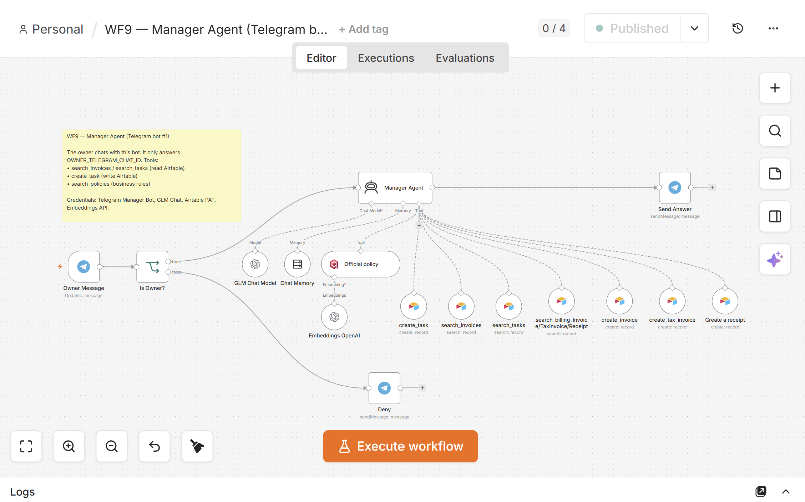

### WF5 — Customer service agent (Telegram bot #2)

Telegram question → agent with two RAG tools (policy + product knowledge) → Telegram answer.

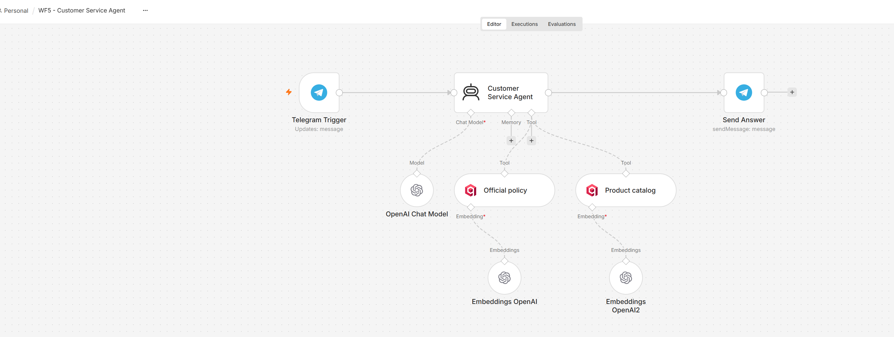

### WF1a/b/c — Tax-document validation

One Airtable trigger + validation/numbering logic per table (Receipts, Invoices, TaxInvoices).

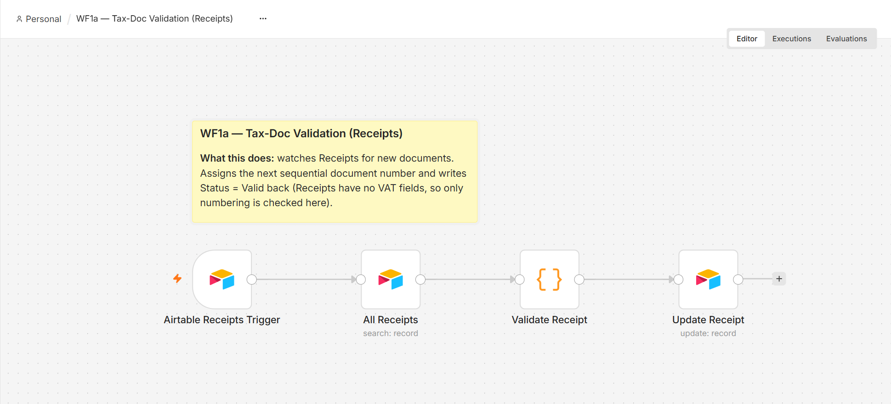
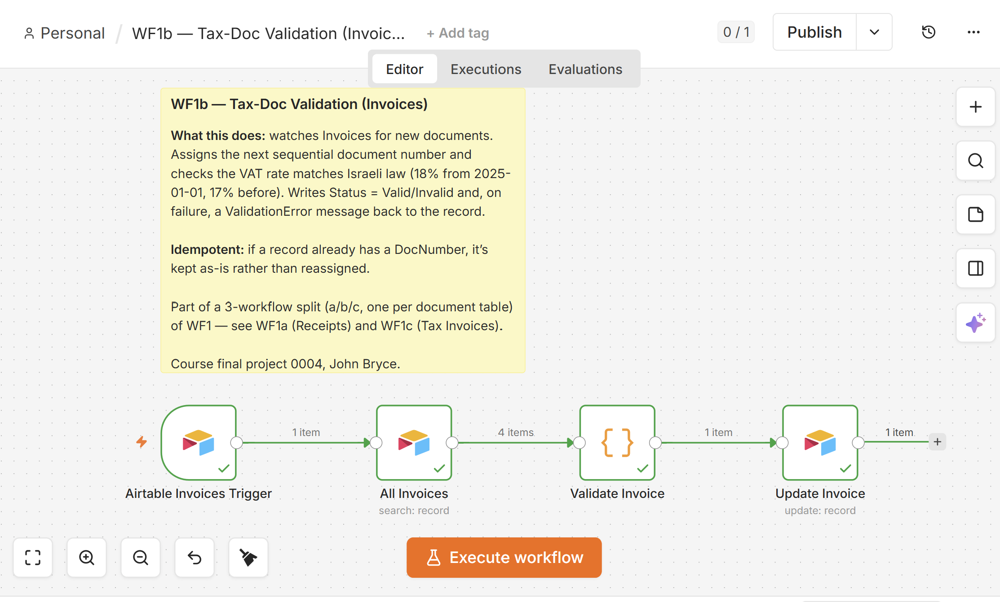
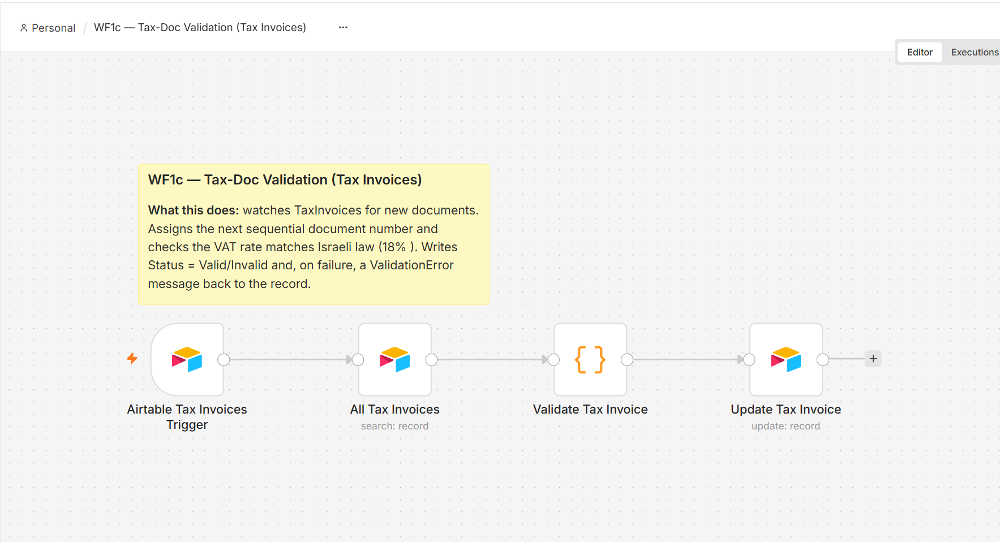

### WF3 — Contact intake + dedupe

Search existing Leads by email → skip create on a match, create on a genuine new lead.

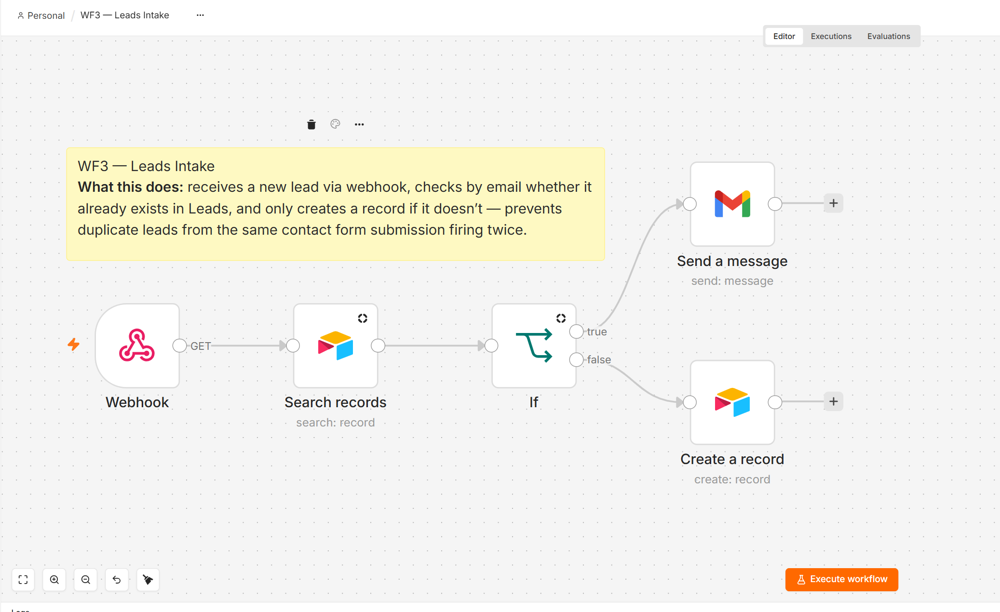

### WF4a / WF4b — Sales agent

Cold email generation + send, and a separate workflow that watches for replies and drafts a response.

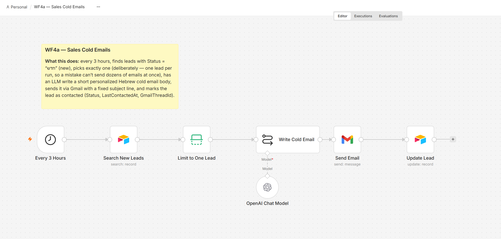
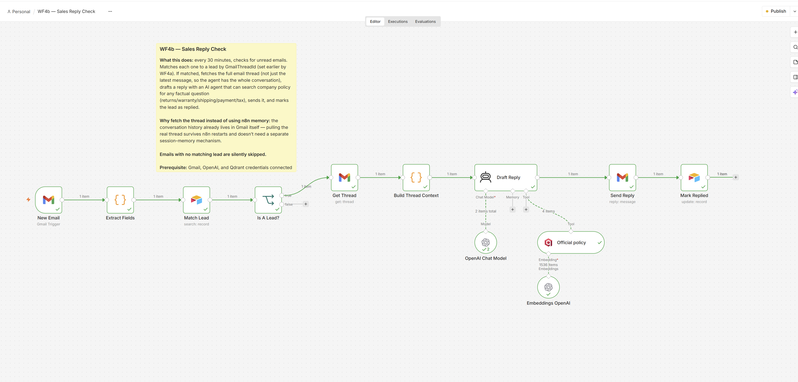

### WF6 / WF7 — Embedding pipelines (Qdrant)

Same shape for both: trigger → load documents → embed → Qdrant insert.

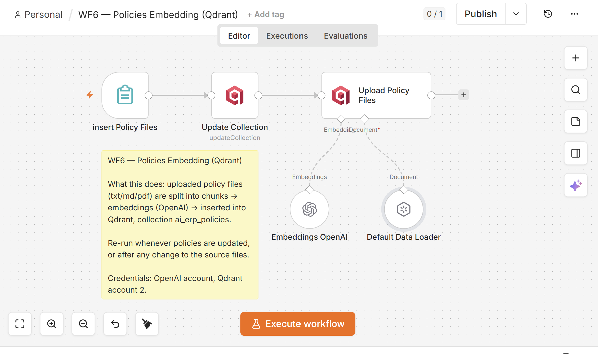
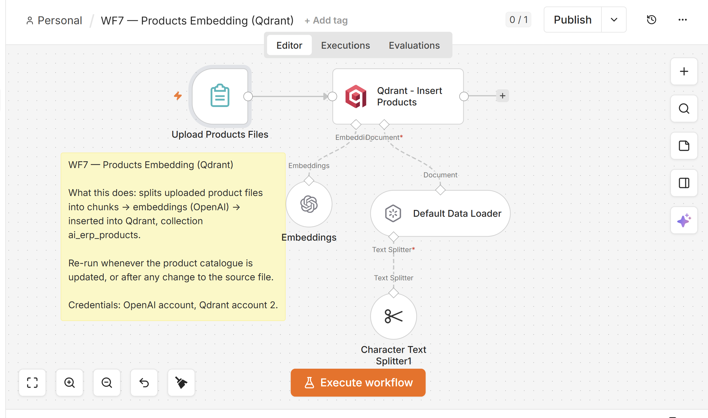

### WF8 — Document → PDF → Drive

Three Airtable pending-document triggers → merged → HTML build (RTL Hebrew) → PDF → upload to Drive → status written back.

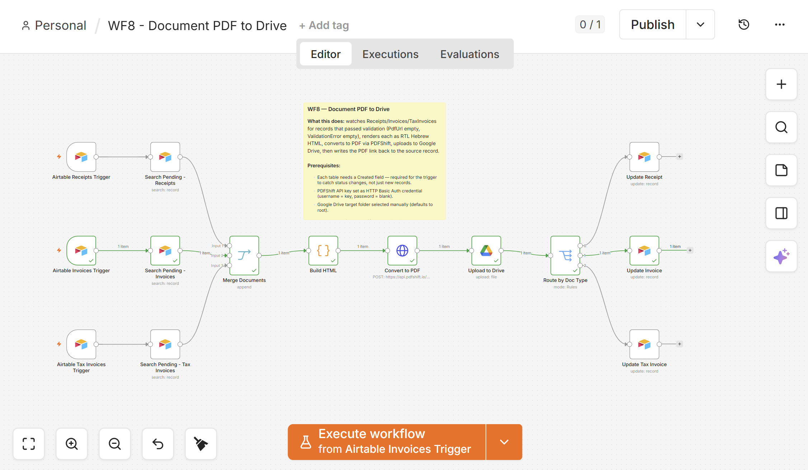

### WF13 — App Gateway (admin app)

Single webhook-triggered agent behind a server-side shared-secret check, powering the Lovable admin app's chat and record-creation flows.

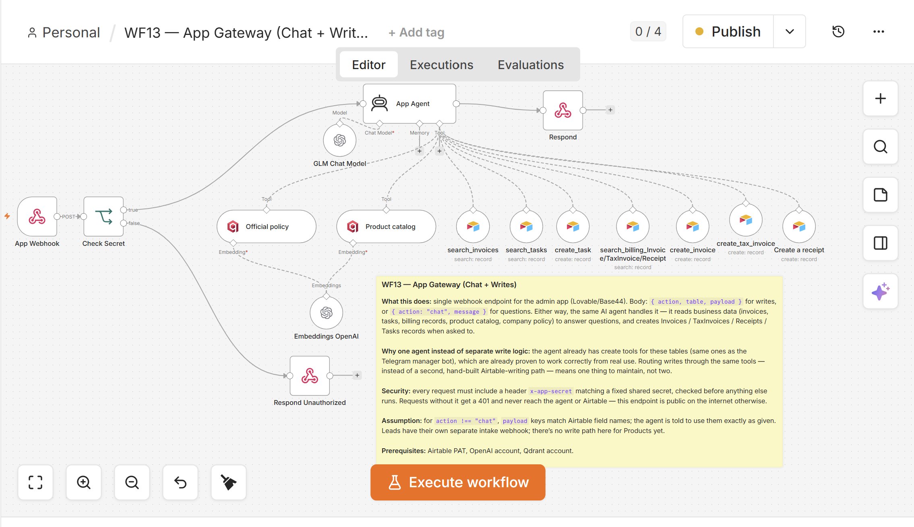

---

## Known limitations

- **Airtable triggers poll at ≥1 minute**, and fire off a `Created`/`Last modified` time field (Airtable has no true "on create" event).
- **Sequential invoice numbering can race** if two documents are created inside the same poll window.
- **Relationships are string foreign keys** (e.g. `CustomerId`), not Airtable links.
- **`VATRate` is a decimal fraction** (`0.18`, not `18`) — mixing this up silently multiplies VAT by 100.

## Repo layout

```
schema/schema.json     ← single source of truth (8 tables)
mock/policies/          ← policy/business-rule docs (*.md), embedded into Qdrant
mock/products/          ← product catalogue (CSV), embedded into Qdrant
templates/              ← invoice/receipt/tax-invoice HTML (RTL Hebrew)
docs/                   ← setup notes + workflow screenshots
```

## Docs

1. [Airtable setup](docs/01-airtable.md) · 2. [Telegram bots](docs/02-telegram-bots.md) · 3. [Google OAuth](docs/03-google-oauth.md) · 4. [Building the workflows](docs/04-workflows.md)
