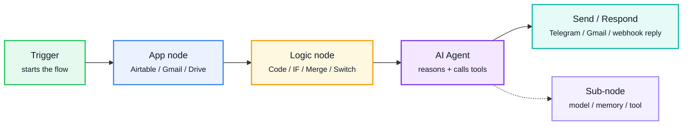

# Diagram legend

Node color = node type, used consistently across every diagram in this folder.

```mermaid
flowchart LR
    classDef trigger fill:#e6f9ee,stroke:#22c55e,stroke-width:2px,color:#111827;
    classDef app fill:#eaf2ff,stroke:#3b82f6,stroke-width:2px,color:#111827;
    classDef logic fill:#fff8e1,stroke:#f59e0b,stroke-width:2px,color:#111827;
    classDef agent fill:#f3e8ff,stroke:#7c3aed,stroke-width:2px,color:#111827;
    classDef subnode fill:#f5f0ff,stroke:#a78bfa,stroke-width:2px,color:#111827;
    classDef send fill:#e6fbf8,stroke:#14b8a6,stroke-width:2px,color:#111827;

    T["Trigger<br/><small>starts the flow</small>"]:::trigger
    A["App node<br/><small>Airtable / Gmail / Drive</small>"]:::app
    L["Logic node<br/><small>Code / IF / Merge / Switch</small>"]:::logic
    G["AI Agent<br/><small>reasons + calls tools</small>"]:::agent
    S["Sub-node<br/><small>model / memory / tool</small>"]:::subnode
    R["Send / Respond<br/><small>Telegram / Gmail / webhook reply</small>"]:::send

    T --> A --> L --> G --> R
    G -.-> S
```
