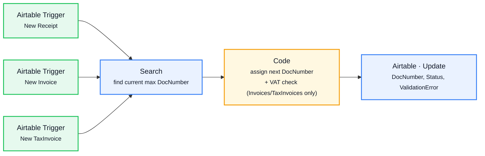

# WF1a/b/c — Tax-document validation

One Airtable trigger per table (Receipts, Invoices, TaxInvoices); Invoices and TaxInvoices additionally get their VAT rate checked against Israeli law.

```mermaid
flowchart LR
    classDef trigger fill:#e6f9ee,stroke:#22c55e,stroke-width:2px,color:#111827;
    classDef app fill:#eaf2ff,stroke:#3b82f6,stroke-width:2px,color:#111827;
    classDef logic fill:#fff8e1,stroke:#f59e0b,stroke-width:2px,color:#111827;

    T1["Airtable Trigger<br/><small>New Receipt</small>"]:::trigger
    T2["Airtable Trigger<br/><small>New Invoice</small>"]:::trigger
    T3["Airtable Trigger<br/><small>New TaxInvoice</small>"]:::trigger

    S["Search<br/><small>find current max DocNumber</small>"]:::app
    C["Code<br/><small>assign next DocNumber<br/>+ VAT check (Invoices/TaxInvoices only)</small>"]:::logic
    U["Airtable · Update<br/><small>DocNumber, Status, ValidationError</small>"]:::app

    T1 --> S
    T2 --> S
    T3 --> S
    S --> C --> U
```
