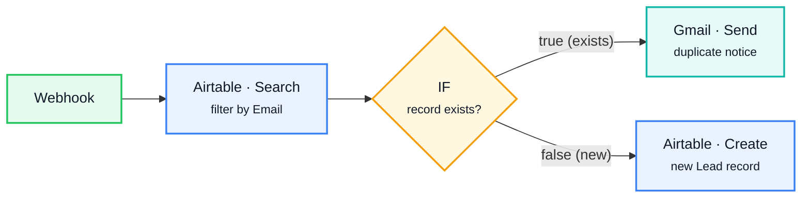

# WF3 — Contact intake + dedupe

Receives a new lead via webhook, checks by email whether it already exists in Leads, and only creates a record if it doesn't.

```mermaid
flowchart LR
    classDef trigger fill:#e6f9ee,stroke:#22c55e,stroke-width:2px,color:#111827;
    classDef app fill:#eaf2ff,stroke:#3b82f6,stroke-width:2px,color:#111827;
    classDef logic fill:#fff8e1,stroke:#f59e0b,stroke-width:2px,color:#111827;
    classDef send fill:#e6fbf8,stroke:#14b8a6,stroke-width:2px,color:#111827;

    W["Webhook"]:::trigger
    S["Airtable · Search<br/><small>filter by Email</small>"]:::app
    I{"IF<br/><small>record exists?</small>"}:::logic
    M["Gmail · Send<br/><small>duplicate notice</small>"]:::send
    C["Airtable · Create<br/><small>new Lead record</small>"]:::app

    W --> S --> I
    I -- "true (exists)" --> M
    I -- "false (new)" --> C
```
