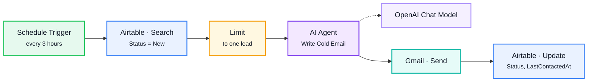

# WF4a — Sales agent, cold emails

Every 3 hours: picks exactly one new lead (deliberately one per run), drafts a personalized email, sends it, marks the lead contacted.

```mermaid
flowchart LR
    classDef trigger fill:#e6f9ee,stroke:#22c55e,stroke-width:2px,color:#111827;
    classDef app fill:#eaf2ff,stroke:#3b82f6,stroke-width:2px,color:#111827;
    classDef logic fill:#fff8e1,stroke:#f59e0b,stroke-width:2px,color:#111827;
    classDef agent fill:#f3e8ff,stroke:#7c3aed,stroke-width:2px,color:#111827;
    classDef subnode fill:#f5f0ff,stroke:#a78bfa,stroke-width:2px,color:#111827;
    classDef send fill:#e6fbf8,stroke:#14b8a6,stroke-width:2px,color:#111827;

    T["Schedule Trigger<br/><small>every 3 hours</small>"]:::trigger
    S["Airtable · Search<br/><small>Status = New</small>"]:::app
    L["Limit<br/><small>to one lead</small>"]:::logic
    AG["AI Agent<br/><small>Write Cold Email</small>"]:::agent
    CM["OpenAI Chat Model"]:::subnode
    G["Gmail · Send"]:::send
    U["Airtable · Update<br/><small>Status, LastContactedAt</small>"]:::app

    T --> S --> L --> AG --> G --> U
    AG -.-> CM
```
