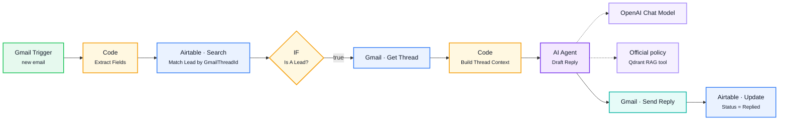

# WF4b — Sales agent, reply check

Every 30 minutes: checks unread emails, matches to a lead, pulls the full thread (not just the latest message), and drafts the next reply.

```mermaid
flowchart LR
    classDef trigger fill:#e6f9ee,stroke:#22c55e,stroke-width:2px,color:#111827;
    classDef app fill:#eaf2ff,stroke:#3b82f6,stroke-width:2px,color:#111827;
    classDef logic fill:#fff8e1,stroke:#f59e0b,stroke-width:2px,color:#111827;
    classDef agent fill:#f3e8ff,stroke:#7c3aed,stroke-width:2px,color:#111827;
    classDef subnode fill:#f5f0ff,stroke:#a78bfa,stroke-width:2px,color:#111827;
    classDef send fill:#e6fbf8,stroke:#14b8a6,stroke-width:2px,color:#111827;

    T["Gmail Trigger<br/><small>new email</small>"]:::trigger
    E["Code<br/><small>Extract Fields</small>"]:::logic
    M["Airtable · Search<br/><small>Match Lead by GmailThreadId</small>"]:::app
    I{"IF<br/><small>Is A Lead?</small>"}:::logic
    G["Gmail · Get Thread"]:::app
    B["Code<br/><small>Build Thread Context</small>"]:::logic
    AG["AI Agent<br/><small>Draft Reply</small>"]:::agent
    CM["OpenAI Chat Model"]:::subnode
    P["Official policy<br/><small>Qdrant RAG tool</small>"]:::subnode
    S["Gmail · Send Reply"]:::send
    U["Airtable · Update<br/><small>Status = Replied</small>"]:::app

    T --> E --> M --> I
    I -- true --> G --> B --> AG --> S --> U
    AG -.-> CM
    AG -.-> P
```
