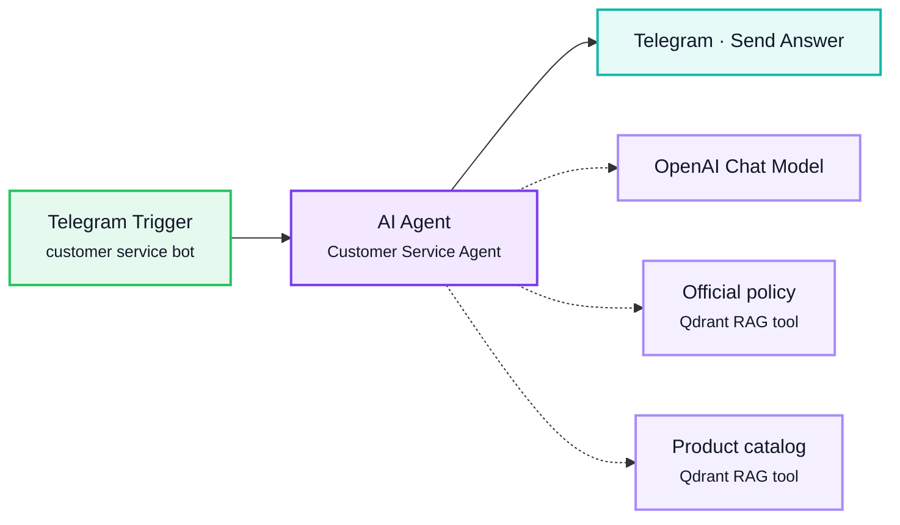

# WF5 — Customer service agent

Answers Telegram questions about products and company policy, grounded entirely in two RAG lookups so the agent never guesses.

```mermaid
flowchart LR
    classDef trigger fill:#e6f9ee,stroke:#22c55e,stroke-width:2px,color:#111827;
    classDef agent fill:#f3e8ff,stroke:#7c3aed,stroke-width:2px,color:#111827;
    classDef subnode fill:#f5f0ff,stroke:#a78bfa,stroke-width:2px,color:#111827;
    classDef send fill:#e6fbf8,stroke:#14b8a6,stroke-width:2px,color:#111827;

    T["Telegram Trigger<br/><small>customer service bot</small>"]:::trigger
    AG["AI Agent<br/><small>Customer Service Agent</small>"]:::agent
    CM["OpenAI Chat Model"]:::subnode
    P["Official policy<br/><small>Qdrant RAG tool</small>"]:::subnode
    PR["Product catalog<br/><small>Qdrant RAG tool</small>"]:::subnode
    S["Telegram · Send Answer"]:::send

    T --> AG --> S
    AG -.-> CM
    AG -.-> P
    AG -.-> PR
```
