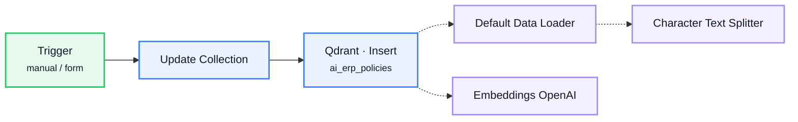

# WF6 — Policies embedding (Qdrant)

Uploaded policy files are split into chunks, embedded, and inserted into the `ai_erp_policies` Qdrant collection. Re-run whenever the source files change.

```mermaid
flowchart LR
    classDef trigger fill:#e6f9ee,stroke:#22c55e,stroke-width:2px,color:#111827;
    classDef app fill:#eaf2ff,stroke:#3b82f6,stroke-width:2px,color:#111827;
    classDef subnode fill:#f5f0ff,stroke:#a78bfa,stroke-width:2px,color:#111827;

    T["Trigger<br/><small>manual / form</small>"]:::trigger
    U["Update Collection"]:::app
    L["Default Data Loader"]:::subnode
    SP["Character Text Splitter"]:::subnode
    E["Embeddings OpenAI"]:::subnode
    Q["Qdrant · Insert<br/><small>ai_erp_policies</small>"]:::app

    T --> U --> Q
    Q -.-> L
    L -.-> SP
    Q -.-> E
```
