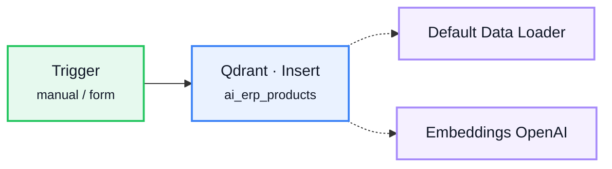

# WF7 — Products embedding (Qdrant)

Same shape as WF6, without a text splitter — product catalogue rows are already short. Inserted into the `ai_erp_products` collection.

```mermaid
flowchart LR
    classDef trigger fill:#e6f9ee,stroke:#22c55e,stroke-width:2px,color:#111827;
    classDef app fill:#eaf2ff,stroke:#3b82f6,stroke-width:2px,color:#111827;
    classDef subnode fill:#f5f0ff,stroke:#a78bfa,stroke-width:2px,color:#111827;

    T["Trigger<br/><small>manual / form</small>"]:::trigger
    L["Default Data Loader"]:::subnode
    E["Embeddings OpenAI"]:::subnode
    Q["Qdrant · Insert<br/><small>ai_erp_products</small>"]:::app

    T --> Q
    Q -.-> L
    Q -.-> E
```
