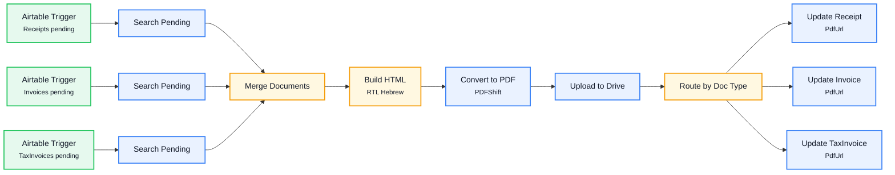

# WF8 — Document → PDF → Drive

Watches Receipts/Invoices/TaxInvoices for records that passed validation, renders each as RTL Hebrew HTML, converts to PDF, uploads to Drive, and writes the PDF link back.

