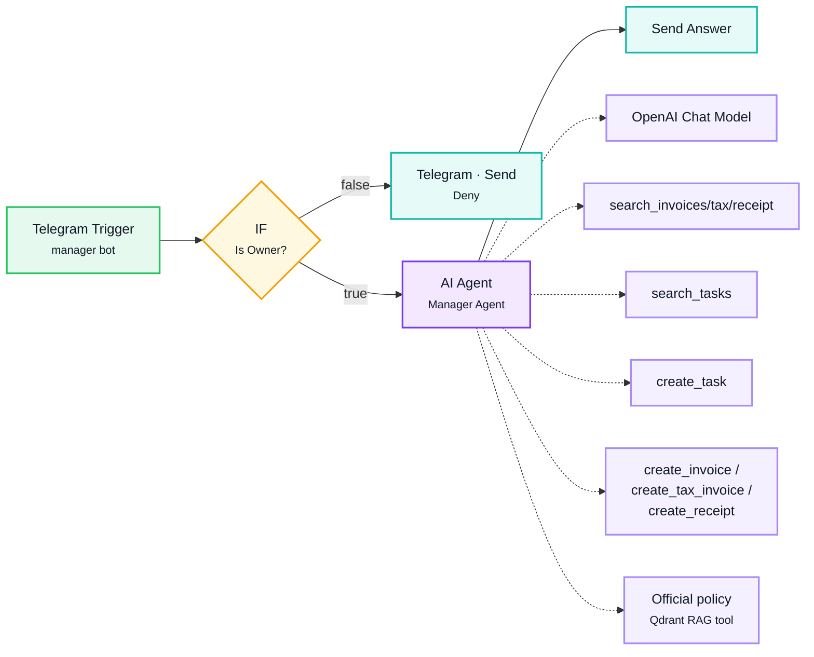

# WF9 — Manager agent (Telegram bot #1)

Owner-only Telegram bot: read tools on all 4 core Airtable tables + the two RAG tools, plus billing-document creation tools added later.

```mermaid
flowchart LR
    classDef trigger fill:#e6f9ee,stroke:#22c55e,stroke-width:2px,color:#111827;
    classDef logic fill:#fff8e1,stroke:#f59e0b,stroke-width:2px,color:#111827;
    classDef agent fill:#f3e8ff,stroke:#7c3aed,stroke-width:2px,color:#111827;
    classDef subnode fill:#f5f0ff,stroke:#a78bfa,stroke-width:2px,color:#111827;
    classDef send fill:#e6fbf8,stroke:#14b8a6,stroke-width:2px,color:#111827;

    T["Telegram Trigger<br/><small>manager bot</small>"]:::trigger
    I{"IF<br/><small>Is Owner?</small>"}:::logic
    D["Telegram · Send<br/><small>Deny</small>"]:::send
    AG["AI Agent<br/><small>Manager Agent</small>"]:::agent
    CM["OpenAI Chat Model"]:::subnode
    S1["search_invoices/tax/receipt"]:::subnode
    S2["search_tasks"]:::subnode
    C1["create_task"]:::subnode
    C2["create_invoice /<br/>create_tax_invoice /<br/>create_receipt"]:::subnode
    P["Official policy<br/><small>Qdrant RAG tool</small>"]:::subnode
    SA["Send Answer"]:::send

    T --> I
    I -- false --> D
    I -- true --> AG --> SA
    AG -.-> CM
    AG -.-> S1
    AG -.-> S2
    AG -.-> C1
    AG -.-> C2
    AG -.-> P
```
