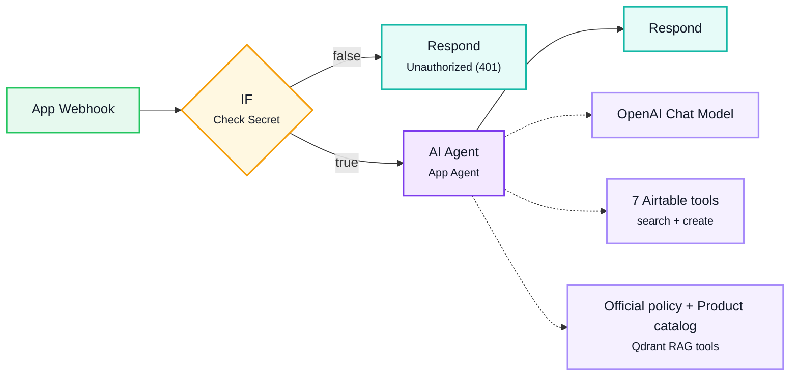

# WF13 — App Gateway (chat + writes)

Single webhook endpoint for the admin app. Every request needs a shared-secret header, checked before anything else runs; requests without it never reach the agent or Airtable.

