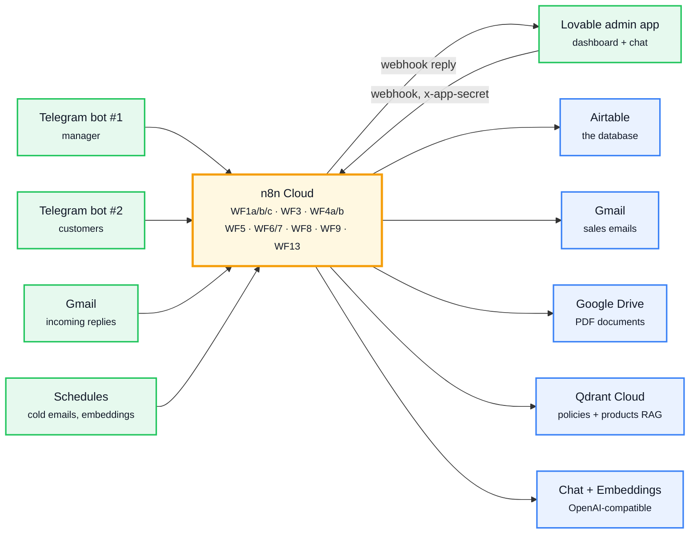

# Overall architecture

How every workflow, external service, and the admin app fit together.

```mermaid
flowchart LR
    classDef trigger fill:#e6f9ee,stroke:#22c55e,stroke-width:2px,color:#111827;
    classDef app fill:#eaf2ff,stroke:#3b82f6,stroke-width:2px,color:#111827;
    classDef agent fill:#f3e8ff,stroke:#7c3aed,stroke-width:2px,color:#111827;
    classDef core fill:#fff8e1,stroke:#f59e0b,stroke-width:3px,color:#111827;

    B1["Telegram bot #1<br/><small>manager</small>"]:::trigger
    B2["Telegram bot #2<br/><small>customers</small>"]:::trigger
    GM["Gmail<br/><small>incoming replies</small>"]:::trigger
    SCH["Schedules<br/><small>cold emails, embeddings</small>"]:::trigger
    APP["Lovable admin app<br/><small>dashboard + chat</small>"]:::trigger

    N8N["n8n Cloud<br/><small>WF1a/b/c · WF3 · WF4a/b<br/>WF5 · WF6/7 · WF8 · WF9 · WF13</small>"]:::core

    AT["Airtable<br/><small>the database</small>"]:::app
    GMOUT["Gmail<br/><small>sales emails</small>"]:::app
    DR["Google Drive<br/><small>PDF documents</small>"]:::app
    QD["Qdrant Cloud<br/><small>policies + products RAG</small>"]:::app
    AI["Chat + Embeddings<br/><small>OpenAI-compatible</small>"]:::app

    B1 --> N8N
    B2 --> N8N
    GM --> N8N
    SCH --> N8N
    APP -- "webhook, x-app-secret" --> N8N
    N8N -- "webhook reply" --> APP

    N8N --> AT
    N8N --> GMOUT
    N8N --> DR
    N8N --> QD
    N8N --> AI
```
